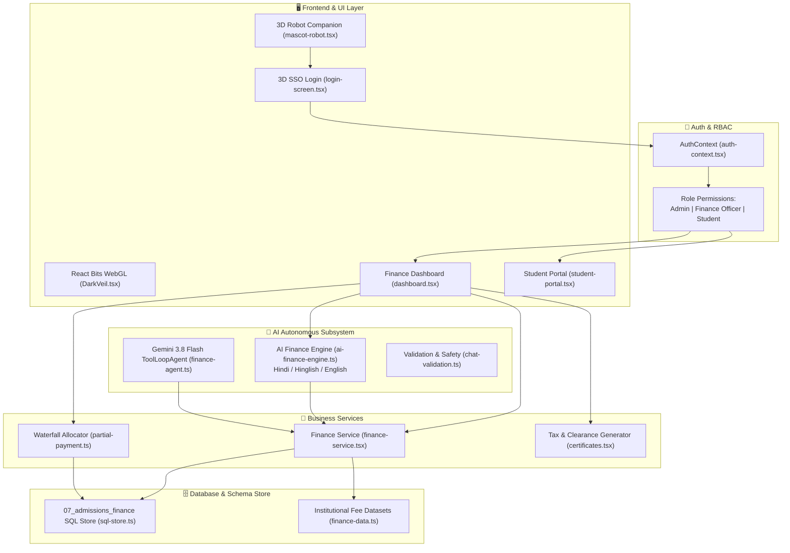

# 🏛️ finDeck - System Architecture & Code Segregation Guide

> **For Evaluators & Reviewers**: This document outlines the end-to-end architecture, domain boundaries, file segregation, and data flow of **finDeck** (formerly FeeWise) — built for Vignan's Foundation for Science, Technology & Research (VFSTR).

---

## 📁 Repository Segregation Overview

```
feewise/
├── ⚙️ backend/                        # BACKEND LOGIC & DATA SUBSYSTEMS
│   ├── 🗄️ database/                  # Relational Schema & Persistence Layer
│   │   ├── sql-store.ts              # PostgreSQL 07_admissions_finance schema + IndexedDB
│   │   ├── finance-data.ts           # Fee heads, institutional ledger dataset, & seeds
│   │   └── index.ts                  # Database barrel export
│   ├── 💼 services/                  # Business Logic & Financial Algorithms
│   │   ├── finance-service.ts        # Ledger reconciliation, snapshot stats, overdue logic
│   │   ├── partial-payment.ts        # Priority-based waterfall installment distribution
│   │   └── index.ts                  # Services barrel export
│   ├── 🤖 ai/                        # AI Agents & LLM Autonomous Engine
│   │   ├── ai-finance-engine.ts      # Multi-turn deterministic + NLP reasoning (Hinglish/English)
│   │   ├── finance-agent.ts          # Vercel AI SDK ToolLoopAgent with Gemini 3.8 Flash tools
│   │   ├── chat-validation.ts        # Zod schema validation, size limits, & guardrails
│   │   └── index.ts                  # AI subsystem barrel export
│   ├── 🔐 auth/                      # Authentication & Access Control (RBAC)
│   │   ├── auth-context.tsx          # User roles (Admin, Finance Officer, Student)
│   │   └── index.ts                  # Auth barrel export
│   └── index.ts                      # Unified backend gateway
│
├── 🖥️ frontend/                       # FRONTEND ARCHITECTURE & DIRECTORY MAP
│   └── index.ts                      # Frontend gateway mapping pages & portals
│
├── 🎨 components/                     # MODULAR UI COMPONENT LIBRARY
│   ├── 🪄 ui/                        # Core Design System & 3D WebGL Components
│   │   ├── mascot-robot.tsx          # 3D Three.js AI Companion (GLB loader + cursor gaze)
│   │   ├── DarkVeil.tsx & .css       # React Bits WebGL OGL shader background
│   │   ├── tilted-card.tsx           # 3D tilt cards with specular lighting
│   │   ├── theme-toggle.tsx          # Light / Dark mode switcher
│   │   ├── findeck-logo.tsx          # Scalable vector branding SVG
│   │   └── base-ui/                  # Buttons, Dialogs, Charts, Badges, Sheets, Inputs
│   ├── 🔑 auth/                      # Authentication & Onboarding
│   │   └── login-screen.tsx          # 3D SSO Login screen with 2FA & Quick Demo auto-fill
│   ├── 📊 finance/                   # Executive & Institutional Dashboards
│   │   ├── dashboard.tsx             # Main command center with 12 modular tab views
│   │   ├── overview.tsx              # Macro collections, ageing analysis, & KPI cards
│   │   ├── assistant.tsx             # AI Financial Copilot dedicated interface
│   │   ├── details.tsx               # Ledger reconciliation & discrepancy audit
│   │   ├── certificates.tsx          # Statutory Section 80C & Fee Clearance certs
│   │   ├── partial-payment-modal.tsx # Waterfall installment calculator modal
│   │   ├── organizer-views.tsx       # Schema compliance inspector for organizers
│   │   └── operations.tsx            # Transaction logs & batch actions
│   └── 🎓 student/                   # Student Self-Service Portal
│       └── student-portal.tsx        # Personal fee passbook, dues, & receipt downloads
│
├── 🌐 app/                           # NEXT.JS APP ROUTER
│   ├── layout.tsx                    # Root layout (Theme + Auth + Font providers)
│   ├── page.tsx                      # Dynamic page router based on auth state
│   ├── globals.css                   # Tailwind CSS v4 design tokens (Dark/Light mode)
│   └── api/chat/route.ts             # Vercel AI SDK route handler for Gemini agent
│
└── 📦 public/                        # STATIC ASSETS & 3D MODELS
    ├── models/
    │   └── ai-companion.glb          # 4.5MB Three.js 3D Robot Mascot model
    ├── findeck-logo.png              # High-res university branding logo
    └── finbot-transparent.png        # Mascot fallback asset
```

---

## 🔄 High-Level Architecture Flow



---

## 🌟 Key Technical Highlights for Evaluation

| Subsystem | File Location | Key Innovation / Features |
| :--- | :--- | :--- |
| **3D AI Companion** | [`components/ui/mascot-robot.tsx`](file:///c:/Users/aksha/Desktop/feewise/components/ui/mascot-robot.tsx) | Real-time WebGL mouse gaze tracking using Three.js + `ai-companion.glb` with 360° orbit drag and dynamic voice bubbles. |
| **WebGL Shader** | [`components/ui/DarkVeil.tsx`](file:///c:/Users/aksha/Desktop/feewise/components/ui/DarkVeil.tsx) | React Bits animated WebGL shader powered by `ogl` with deep obsidian color palette. |
| **Multilingual AI** | [`backend/ai/ai-finance-engine.ts`](file:///c:/Users/aksha/Desktop/feewise/backend/ai/ai-finance-engine.ts) | Fully capable of parsing conversational Hindi, Hinglish, and English financial queries. |
| **SQL Schema Store** | [`backend/database/sql-store.ts`](file:///c:/Users/aksha/Desktop/feewise/backend/database/sql-store.ts) | Strict compliance with hackathon organizer `07_admissions_finance.sql` tables, foreign keys, and audit trails. |
| **Priority Waterfall** | [`backend/services/partial-payment.ts`](file:///c:/Users/aksha/Desktop/feewise/backend/services/partial-payment.ts) | Institutional fee head hierarchy algorithm (Tuition → Exam → Library → Lab → Transport → Hostel). |
| **Dual Theme** | [`app/globals.css`](file:///c:/Users/aksha/Desktop/feewise/app/globals.css) & [`components/ui/theme-toggle.tsx`](file:///c:/Users/aksha/Desktop/feewise/components/ui/theme-toggle.tsx) | Flawless light & dark mode support with instant toggle across all portals. |
